# Lugli - Achievements

Project Zomboid **B42** has no achievements. This adds 250+ of them, earned by what your survivor
actually does. Every one is listed in [the roster](#the-roster) at the end, with the icon, name,
description and goal the game shows.

Needs [NeatUI Framework](https://steamcommunity.com/sharedfiles/filedetails/?id=3508537032) for the
window and the toast. Pure Lua otherwise, no jar.

**It changes nothing about how the game plays.** No items, no XP, no loot, no spawns, no recipes.
It watches, it counts, and it tells you.

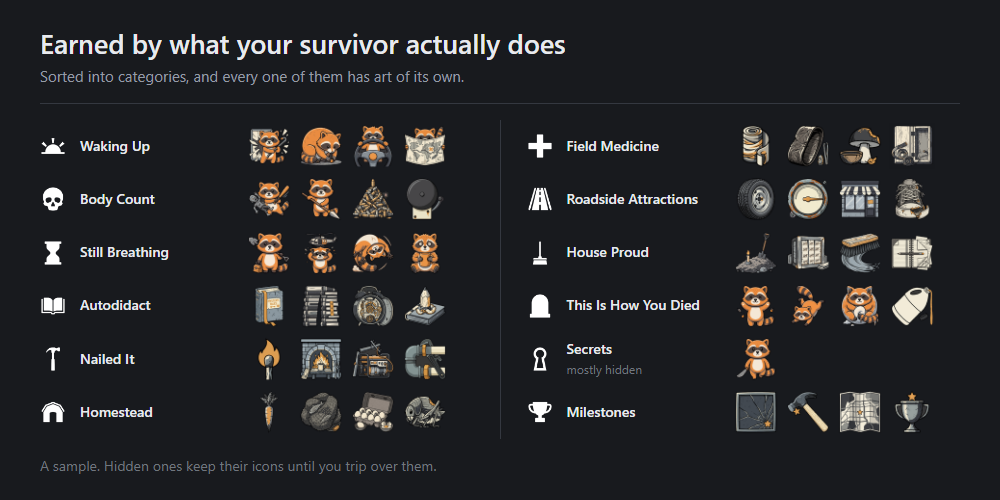

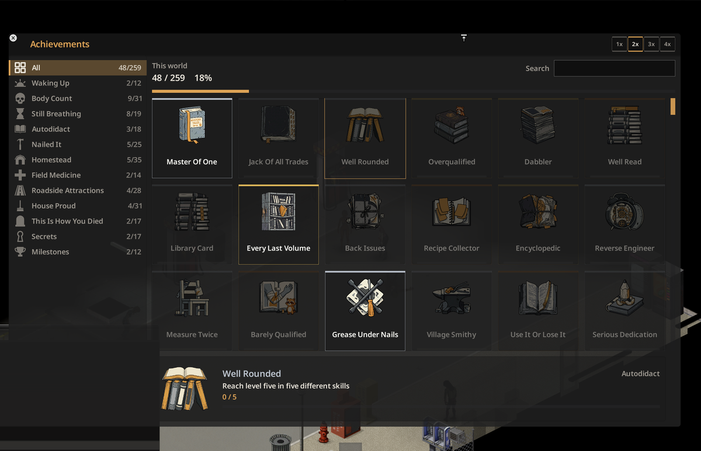

## Where progress lives

Per world by default: one collection shared by every survivor in the save, so a death does not
restart it. That is also what lets an achievement be earned **by** dying, at the moment the
character earning it stops existing, and lets the ledger record who got there first.

A tickbox in the mod options switches to per character. Switching deletes nothing: the two are
separate stores, and turning it back brings the old one straight back.

Both are `ModData` tables of the mod's own. Nothing else in the save is touched, and the per-world
store is `GlobalModData`, which only crosses the wire if a mod asks it to. This one never does.

## Adding your own

```lua
LugliAchievements.register{
    id          = "yourmod_thing_10",
    name        = "UI_YourMod_thing_10_name",
    description = "UI_YourMod_thing_10_desc",
    category    = "yourmod_cat",
    stat        = "yourmod_things",
    target      = 10,
    tier        = "silver",
    source      = "YourMod",
}

LugliAchievements.incStat(player, "yourmod_things", 1)
```

It appears in the window, tracks itself, saves itself and raises its own toast.

`icon` is optional: leave it out and the id decides the path. `registerCategory` adds a category.
First registration of an id wins; a duplicate is rejected and logged with both sources. A condition
that is not a running total is a stat set to 1 with `target = 1`.

Achievements are indexed by the stat they watch, so `incStat` only ever wakes the handful watching
that stat, never the whole roster.

## Reliability

Every achievement is checked against the trackers at build time, so one watching a counter nothing
writes cannot ship. Two offline suites run in the game's own Kahlua VM against the real shipped
files, with mutation tests proving the suites can fail.

Timed-action wrappers call through first and count afterwards inside `pcall`, so a counting bug
cannot break the action it watches. A part that fails to install says so on the main menu.

## Compatibility

- **Mid-save:** anything the game still knows about is credited on the next load, so days survived
  and recipes known come across immediately. Counters that only existed because the mod was
  watching, like kills and things built, start from zero. Skill levels register on the next level.
- **Removal:** safe. The save loads normally; reinstall and your progress is still there.
- **Multiplayer:** every player keeps their own collection against a server. Nobody else's kills
  unlock yours.
- **Dedicated server:** nothing loads. `client/` does not run in a server process, so no tracker
  registers, the roster is never built, and nothing is written to server state. Verified against a
  real headless server.
- English and Brazilian Portuguese, both complete. A build gate refuses a language missing a key.

## The roster

Every achievement that ships, with the icon, name, description and goal the game itself uses.
The tables below are generated from the mod's own definitions and its English translations, so
they cannot drift from what you actually play.

<!-- BEGIN ROSTER: generated from the shipped definitions. Do not edit by hand. -->

| | Category | Achievements | Bronze | Silver | Gold |
|---|---|--:|--:|--:|--:|
| 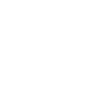 | [Waking Up](#waking-up) | 12 | 12 | 0 | 0 |
|  | [Body Count](#body-count) | 31 | 5 | 23 | 3 |
| 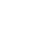 | [Still Breathing](#still-breathing) | 19 | 5 | 12 | 2 |
|  | [Autodidact](#autodidact) | 18 | 4 | 10 | 4 |
|  | [Nailed It](#nailed-it) | 25 | 8 | 15 | 2 |
|  | [Homestead](#homestead) | 35 | 10 | 21 | 4 |
|  | [Field Medicine](#field-medicine) | 14 | 5 | 8 | 1 |
| 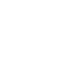 | [Roadside Attractions](#roadside-attractions) | 28 | 11 | 12 | 5 |
| 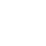 | [House Proud](#house-proud) | 31 | 10 | 17 | 4 |
|  | [This Is How You Died](#this-is-how-you-died) | 17 | 13 | 4 | 0 |
|  | [Secrets](#secrets) | 16 | 7 | 6 | 3 |
|  | [Milestones](#milestones) | 12 | 0 | 0 | 12 |
| | **Total** | **258** | **90** | **128** | **40** |

### Waking Up

| | Achievement | How you get it | Goal | Tier |
|---|---|---|---|---|
| 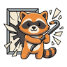 | **Fresh Air** | Smash your first window. Nobody is coming to bill you for it | once | Bronze |
| 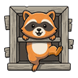 | **In Through The Out** | Climb through your first window | once | Bronze |
| 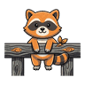 | **Fence Sitter** | Climb over your first fence | once | Bronze |
| 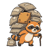 | **Load Bearing** | Become overburdened for the first time | once | Bronze |
|  | **Ground Score** | Forage your first item off the ground | once | Bronze |
| 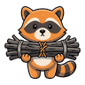 | **Hand Made** | Craft your first item | once | Bronze |
| 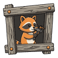 | **First Fixture** | Build your first thing | once | Bronze |
|  | **Learner Plates** | Get into a vehicle | once | Bronze |
|  | **Chapter One** | Finish reading your first book | once | Bronze |
| 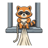 | **Rope Access** | Tie your first sheet rope | once | Bronze |
| 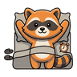 | **Day Two** | Live to see a second morning | once | Bronze |
|  | **You Are Here** | Read a map | once | Bronze |

### Body Count

| | Achievement | How you get it | Goal | Tier |
|---|---|---|---|---|
| 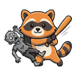 | **First Blood** | Kill your first zombie. There are a few more | once | Bronze |
| 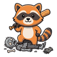 | **Getting The Hang** | Kill one hundred zombies | 100 zombies | Silver |
| 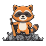 | **Thinning The Herd** | Kill one thousand zombies | 1,000 zombies | Silver |
| 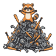 | **Population Control** | Kill five thousand zombies | 5,000 zombies | Gold |
| 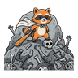 | **Hero Syndrome** | Kill ten thousand zombies. You were going to clear Louisville | 10,000 zombies | Gold |
| 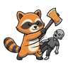 | **Timber** | Kill 250 zombies with an axe | 250 zombies | Silver |
| 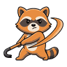 | **Blunt Instrument** | Kill 250 zombies with a blunt weapon | 250 zombies | Silver |
|  | **Pocket Percussion** | Kill 150 zombies with a small blunt weapon | 150 zombies | Silver |
| 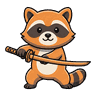 | **Clean Sweep** | Kill 150 zombies with a long blade | 150 zombies | Silver |
| 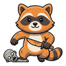 | **Up Close** | Kill 150 zombies with a small blade | 150 zombies | Silver |
| 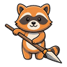 | **Arms Length** | Kill 100 zombies with a spear | 100 zombies | Silver |
| 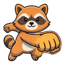 | **Bare Hands** | Kill 25 zombies with your hands | 25 zombies | Silver |
|  | **Whatever Was Handy** | Kill 100 zombies with an improvised weapon | 100 zombies | Silver |
| 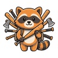 | **Full Toolbox** | Kill a zombie with all eight weapon classes | 8 | Silver |
| 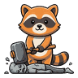 | **Double Tap** | Finish off one hundred downed zombies | 100 zombies | Silver |
| 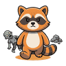 | **One And Done** | Kill one hundred zombies in a single hit | 100 zombies | Silver |
| 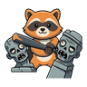 | **Aim For The Head** | Land five hundred hits on the head | 500 | Silver |
| 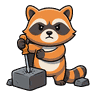 | **Weak Point** | Land 250 critical hits | 250 | Silver |
| 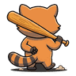 | **You Can Just Walk** | Survive a day with no kills after your first hundred | once | Bronze |
| 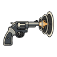 | **Loud Noises** | Fire a gun. Everyone heard that | once | Bronze |
| 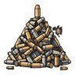 | **Trigger Discipline** | Fire one hundred shots | 100 shots | Silver |
| 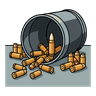 | **Ammo Economy** | Fire one thousand shots | 1,000 shots | Silver |
| 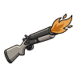 | **Point Blank** | Kill a zombie with a firearm | once | Bronze |
| 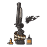 | **Gun Nut** | Kill 500 zombies with firearms | 500 zombies | Gold |
| 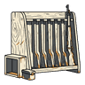 | **The Whole Armoury** | Fire all twenty two firearms | 22 | Silver |
| 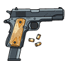 | **Muscle Memory** | Reload one hundred times | 100 | Silver |
| 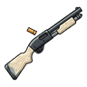 | **Rack And Ruin** | Rack a weapon fifty times | 50 | Silver |
| 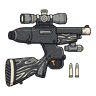 | **Aftermarket** | Fit ten weapon upgrades | 10 | Silver |
| 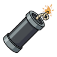 | **We Need More Boom** | Set off your first explosive | once | Bronze |
| 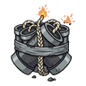 | **Demolition Permit** | Set off twenty five explosives | 25 | Silver |
| 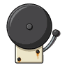 | **Ringing Endorsement** | Trip ten house alarms and live | 10 | Silver |

### Still Breathing

| | Achievement | How you get it | Goal | Tier |
|---|---|---|---|---|
| 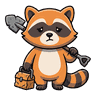 | **Nine To Five** | Survive seven days. A full working week, and no weekend | 7 days | Silver |
| 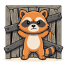 | **Twenty Eight Days** | Survive twenty eight days, when the horde peaks | 28 days | Silver |
| 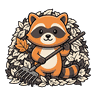 | **Seasonal Worker** | Survive ninety days | 90 days | Silver |
|  | **Half A Year Gone** | Survive one hundred and eighty days | 180 days | Silver |
| 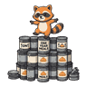 | **Anniversary** | Survive a full year with one survivor | 365 days | Gold |
| 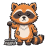 | **Two Years Gone** | Survive two years with one survivor | 730 days | Gold |
|  | **Helicopter Parenting** | Live through the helicopter. It was never a rescue | once | Bronze |
|  | **First Frost** | Survive into winter | once | Bronze |
|  | **Round The Sun** | See all four seasons on one character | 4 | Silver |
|  | **Whiteout** | Live through a blizzard | once | Bronze |
| 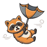 | **Weather The Storm** | Live through a tropical storm | once | Bronze |
| 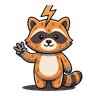 | **Counting Seconds** | Be outdoors for fifty thunder strikes | 50 | Silver |
|  | **Untouchable** | Go seven days without taking a hit | 7 days | Silver |
|  | **How Did We Get Here** | Carry eight negative moodles at once | 8 | Silver |
|  | **Sleep Tight** | Climb into a bed fifty times | 50 | Silver |
|  | **Take Five** | Rest one hundred times | 100 | Silver |
|  | **Staying Hydrated** | Drink five hundred times | 500 | Silver |
|  | **Something Died** | Get the noxious smell moodle | once | Bronze |
|  | **Wired** | Stay awake for three days straight | 72 | Silver |

### Autodidact

| | Achievement | How you get it | Goal | Tier |
|---|---|---|---|---|
|  | **Master Of One** | Take any skill to level ten | 10 | Silver |
|  | **Jack Of All Trades** | Reach level three in ten different skills | 10 | Silver |
|  | **Well Rounded** | Reach level five in five different skills | 5 | Silver |
|  | **Overqualified** | Reach level ten in three different skills | 3 | Gold |
|  | **Dabbler** | Reach level one in all thirty five skills | 35 | Gold |
|  | **Well Read** | Finish ten books | 10 books | Bronze |
|  | **Library Card** | Finish fifty books | 50 books | Silver |
|  | **Every Last Volume** | Finish all one hundred and twenty skill books | 120 books | Gold |
|  | **Back Issues** | Read fifty recipe magazines | 50 magazines | Silver |
|  | **Recipe Collector** | Know fifty recipes | 50 recipes | Bronze |
|  | **Encyclopedic** | Know three hundred recipes | 300 recipes | Gold |
|  | **Reverse Engineer** | Research twenty five recipes | 25 | Silver |
|  | **Measure Twice** | Reach Carpentry level ten | 10 | Silver |
|  | **Barely Qualified** | Reach First Aid level five | 5 | Bronze |
|  | **Grease Under Nails** | Reach Mechanics level seven | 7 | Silver |
|  | **Village Smithy** | Reach Blacksmith level seven | 7 | Silver |
|  | **Use It Or Lose It** | Lose a skill level | once | Bronze |
|  | **Serious Dedication** | Earn one hundred thousand XP | 100,000 | Silver |

### Nailed It

| | Achievement | How you get it | Goal | Tier |
|---|---|---|---|---|
|  | **Prometheus** | Light your first fire | once | Bronze |
|  | **Burning The Books** | Light a fire with a book | once | Bronze |
|  | **Accelerant** | Light ten fires with petrol | 10 | Silver |
|  | **Fire Marshal** | Put out twenty five fires | 25 | Silver |
|  | **Candlelight** | Snuff out fifty candles | 50 | Silver |
|  | **Cold Hearth** | Clear ashes twenty five times | 25 | Silver |
|  | **Grill Master** | Light or refuel a barbecue one hundred times | 100 | Silver |
|  | **Cocktail Hour** | Throw twenty five molotovs | 25 | Silver |
|  | **This Is Fine** | Set yourself alight and survive it | once | Bronze |
|  | **Some Assembly** | Build ten things | 10 things | Bronze |
|  | **Contractor** | Build one hundred things | 100 things | Silver |
|  | **Zoning Violation** | Build five hundred things | 500 things | Gold |
|  | **Board Meeting** | Put up ten barricades | 10 | Bronze |
|  | **Squatters Rights** | Put up fifty barricades | 50 | Silver |
|  | **Wall To Wall** | Build twenty five walls | 25 | Silver |
|  | **Let There Be Light** | Hook up and start a generator | once | Bronze |
|  | **Grid Independence** | Start five generators | 5 | Silver |
|  | **Home Sweet Home** | Claim a safehouse | once | Bronze |
|  | **Cottage Industry** | Craft one hundred items | 100 items | Silver |
|  | **Wax On** | Craft one thousand items | 1,000 items | Gold |
|  | **Interior Design** | Build in ten different rooms | 10 | Silver |
|  | **Salvage Rights** | Dismantle one hundred things | 100 | Silver |
|  | **Keep Out** | Fit ten padlocks | 10 | Silver |
|  | **Going Down** | Dig a staircase | once | Bronze |
|  | **Indoor Plumbing** | Plumb five things | 5 | Silver |

### Homestead

| | Achievement | How you get it | Goal | Tier |
|---|---|---|---|---|
|  | **Green Thumb** | Harvest your first crop | once | Bronze |
|  | **Subsistence** | Harvest fifty crops | 50 crops | Silver |
|  | **Seed Money** | Plant twenty five seeds | 25 | Silver |
|  | **Crop Rotation** | Grow all twelve kinds of crop | 12 | Silver |
|  | **Watering Can** | Water a plant one hundred times | 100 | Silver |
|  | **Rot Economy** | Add to a compost heap twenty five times | 25 | Silver |
|  | **Reaper** | Scythe one hundred times | 100 | Silver |
|  | **Deforestation** | Chop down one hundred trees | 100 | Silver |
|  | **Hooked** | Catch your first fish | once | Bronze |
|  | **Gone Fishing** | Catch fifty fish | 50 fish | Silver |
|  | **Something Is Biting** | Catch twenty different fish species | 20 | Silver |
|  | **Net Profit** | Check a fishing net twenty five times | 25 | Silver |
|  | **Set A Trap** | Place your first trap | once | Bronze |
|  | **Whole Trapline** | Use all six kinds of trap | 6 | Silver |
|  | **A Balanced Diet** | Eat twenty different kinds of food | 20 | Bronze |
|  | **Adventurous Palate** | Eat forty different kinds of food | 40 | Gold |
|  | **Cutting Onions** | Cook one hundred meals | 100 | Silver |
|  | **Forager** | Forage five hundred items | 500 items | Gold |
|  | **Good Boy** | Pet an animal. It has been a long apocalypse | once | Bronze |
|  | **Feeding Time** | Feed an animal by hand fifty times | 50 | Silver |
|  | **Got Milk** | Milk an animal | once | Bronze |
|  | **Dairy Farmer** | Milk animals one hundred times | 100 | Gold |
|  | **Shear Delight** | Shear twenty five animals | 25 | Silver |
|  | **Eggcellent** | Collect one hundred eggs | 100 | Silver |
|  | **Nose To Tail** | Butcher your first animal | once | Bronze |
|  | **The Whole Herd** | Butcher fifty animals | 50 | Gold |
|  | **Tanner** | Take leather from twenty five animals | 25 | Silver |
|  | **Bone Collector** | Take bones from fifty animals | 50 | Silver |
|  | **Coop Deville** | Put an animal in a hutch | once | Bronze |
|  | **Come Here Often** | Lure ten animals | 10 | Silver |
|  | **Livestock Transport** | Move an animal in a trailer | once | Bronze |
|  | **Menagerie** | Handle ten kinds of animal | 10 | Silver |
|  | **Tracker** | Inspect twenty five animal tracks | 25 | Silver |
|  | **Hung Out To Dry** | Hang ten animals on a butcher hook | 10 | Silver |
|  | **Protein Is Protein** | Eat an insect. It was that or nothing | once | Bronze |

### Field Medicine

| | Achievement | How you get it | Goal | Tier |
|---|---|---|---|---|
|  | **Just A Scratch** | Apply your first bandage | once | Bronze |
|  | **Walking Wounded** | Apply fifty bandages | 50 | Silver |
|  | **Needlework** | Stitch five wounds | 5 | Silver |
|  | **Field Expedient** | Splint a fracture | once | Bronze |
|  | **Bite The Bullet** | Dig a bullet out of yourself | once | Bronze |
|  | **Crunchy Underfoot** | Pull glass out of yourself ten times | 10 | Silver |
|  | **Old Remedies** | Apply ten herbal cataplasms | 10 | Silver |
|  | **Better Living** | Take one hundred pills | 100 | Silver |
|  | **Second Opinion** | Check yourself over fifty times | 50 | Silver |
|  | **Tastes Funny** | Poison yourself | once | Bronze |
|  | **Gravity Always Wins** | Take fall damage ten times | 10 | Silver |
|  | **Comprehensive** | Take ten of the thirteen kinds of damage | 10 | Gold |
|  | **Positive Result** | Catch the Knox infection and know it | once | Bronze |
|  | **Knitted Back** | Break a bone and heal it all the way | once | Silver |

### Roadside Attractions

| | Achievement | How you get it | Goal | Tier |
|---|---|---|---|---|
|  | **Sunday Driver** | Drive one hundred kilometres | 100,000 metres | Bronze |
|  | **The Long Haul** | Drive one thousand kilometres | 1,000,000 metres | Gold |
|  | **Test Drive** | Drive ten different vehicles | 10 | Silver |
|  | **Commuter** | Get into a vehicle one hundred times | 100 | Silver |
|  | **Shotgun** | Change seats ten times | 10 | Silver |
|  | **Hands Dirty** | Fit or remove your first vehicle part | once | Bronze |
|  | **Full Service** | Fit or remove twenty five vehicle parts | 25 | Silver |
|  | **Pump Action** | Add fuel one hundred times | 100 | Silver |
|  | **Jump Start** | Charge a car battery ten times | 10 | Silver |
|  | **Running On Fumes** | Drive below five percent fuel | once | Bronze |
|  | **Louisville Or Bust** | Reach Louisville. All roads lead there eventually | once | Bronze |
|  | **Every Last Corner** | Visit all nine named regions | 9 | Silver |
|  | **Departures** | Reach the Louisville airport | once | Bronze |
|  | **Nosy** | See one hundred rooms | 100 | Bronze |
|  | **Is It A Bird** | See one thousand rooms | 1,000 | Gold |
|  | **Every Kind Of Room** | See fifty different kinds of room | 50 | Silver |
|  | **House Hunting** | Fully explore ten buildings | 10 | Bronze |
|  | **Estate Agent** | Fully explore fifty buildings | 50 | Gold |
|  | **Window Shopping** | Enter twenty five shops | 25 | Silver |
|  | **Room With A View** | Enter one hundred bathrooms | 100 | Silver |
|  | **Sanctuary** | Enter ten churches | 10 | Silver |
|  | **Correctional** | Reach the prison cells | once | Bronze |
|  | **Mans Best Friend** | Find your first Spiffo plush | once | Bronze |
|  | **Idol Of The Far Gone** | Find a Big Spiffo | once | Bronze |
|  | **Playtime** | Collect ten different toys | 10 toys | Silver |
|  | **The Whole Toybox** | Collect all twenty six toys | 26 toys | Gold |
|  | **Cardio** | Cover ten kilometres on foot | 10,000 metres | Bronze |
|  | **Comfortable Shoes** | Cover one hundred kilometres on foot | 100,000 metres | Gold |

### House Proud

| | Achievement | How you get it | Goal | Tier |
|---|---|---|---|---|
|  | **Full Honours** | Bury a corpse | once | Bronze |
|  | **Gravedigger** | Bury fifty corpses | 50 | Silver |
|  | **Ashes To Ashes** | Burn one hundred corpses | 100 | Silver |
|  | **Out The Window** | Throw ten corpses through a window | 10 | Silver |
|  | **Over The Fence** | Throw ten corpses over a fence | 10 | Silver |
|  | **Body Of Work** | Drag twenty five corpses somewhere else | 25 | Silver |
|  | **Bin Day** | Put five corpses in a container | 5 | Silver |
|  | **Antique Roadshow** | Carry one hundred kilos at once | 100 | Bronze |
|  | **Structural Concerns** | Carry one hundred and fifty kilos at once | 150 | Gold |
|  | **Collector** | Hold one hundred different item types | 100 types | Bronze |
|  | **Completionist** | Hold five hundred different item types | 500 types | Gold |
|  | **Magpie** | Pick up one thousand items | 1,000 items | Bronze |
|  | **Serious Hoarding** | Pick up ten thousand items | 10,000 items | Gold |
|  | **Macho Man** | Carry forty kilos in both hands at once | once | Bronze |
|  | **One More Trip** | Get yourself overburdened fifty times | 50 | Silver |
|  | **Every Last Drop** | Consolidate drainables one hundred times | 100 | Silver |
|  | **Tip It Out** | Dump a container fifty times | 50 | Silver |
|  | **Key To The City** | Find a sledgehammer | once | Bronze |
|  | **Spot Of Bother** | Mop up your first bloodstain | once | Bronze |
|  | **Out Damned Spot** | Mop up five hundred bloodstains | 500 | Gold |
|  | **Nothing To See** | Clean twenty five pieces of graffiti | 25 | Silver |
|  | **Personal Hygiene** | Wash yourself fifty times | 50 | Silver |
|  | **Laundry Day** | Wash one hundred pieces of clothing | 100 | Silver |
|  | **Running Repairs** | Repair fifty pieces of clothing | 50 | Silver |
|  | **New Look** | Cut your own hair | once | Bronze |
|  | **Dyeing Wish** | Dye your hair | once | Bronze |
|  | **Well Groomed** | Trim your beard ten times | 10 | Silver |
|  | **Face The Day** | Put on makeup | once | Bronze |
|  | **Net Curtains** | Open or close fifty curtains | 50 | Silver |
|  | **Lights Out** | Flick a light switch one hundred times | 100 | Silver |
|  | **Dear Diary** | Write on ten notes | 10 | Silver |

### This Is How You Died

| | Achievement | How you get it | Goal | Tier |
|---|---|---|---|---|
|  | **The First Time** | Die. It happens to everyone eventually | once | Bronze |
|  | **Short Career** | Die on your first day | once | Bronze |
|  | **Beware Of Bathrooms** | Die in a bathroom. They were in there together | once | Bronze |
|  | **Mach Jesus** | Die of a vehicle crash | once | Bronze |
|  | **Well Done** | Die on fire | once | Bronze |
|  | **We Need To Go Deeper** | Die from a fall | once | Bronze |
|  | **Forgot To Pause** | Die of thirst | once | Bronze |
|  | **Empty Larder** | Die of hunger | once | Bronze |
|  | **Into The Wild** | Die of poison. The Herbalist would have flagged it | once | Bronze |
|  | **The Slow News** | Die of the Knox infection | once | Bronze |
|  | **Twenty Seconds** | Bleed to death | once | Bronze |
|  | **Cold Comfort** | Die of hypothermia | once | Bronze |
|  | **Miles From Anywhere** | Die outside every named region | once | Silver |
|  | **Ended By Livestock** | Die with an animal as the last thing that hurt you | once | Silver |
|  | **The Long Goodbye** | Die having survived a full year | once | Silver |
|  | **Member Of The Horde** | Die knowing you will be getting back up | once | Silver |
|  | **The Easy Way Out** | Drink bleach and let it finish the job | once | Bronze |

### Secrets

| | Achievement | How you get it | Goal | Tier |
|---|---|---|---|---|
|  | **Silence Is Golden** | Kill 500 zombies without ever firing a gun | 500 zombies | Silver |

<details>
<summary><b>15 hidden achievements.</b> These show only a teaser in game until you trip over them. Open at your own risk.</summary>

| | Achievement | How you get it | Goal | Tier |
|---|---|---|---|---|
|  | **Glued To The Set** | Somebody kept broadcasting after the world stopped watching | 12 days | Gold |
|  | **Couch Potato** | Every channel still has something to say | 10 | Silver |
|  | **Airwaves** | Somewhere out there, a voice is still on the air | 5 | Silver |
|  | **Classified** | Some numbers were never meant for civilians | once | Bronze |
|  | **Off The Grid** | The lights were always going to go out | 30 days | Gold |
|  | **Rationing** | The taps run dry eventually. What then | 30 days | Gold |
|  | **Was That A Sprinter** | Something moved faster than it had any right to | once | Bronze |
|  | **Playing Possum** | Not all of them are finished | once | Bronze |
|  | **Nothing To Wear** | Clothing turns out to be optional | 50 zombies | Silver |
|  | **Cold Open** | Shelter is a choice, and you can make the wrong one | once | Bronze |
|  | **Doors And Corners** | Some survivors barely swing at all | 30 days | Silver |
|  | **Any News About Him** | Not every house ends at the ground floor | once | Bronze |
|  | **Necrophobia** | Something is going to make you jump | once | Bronze |
|  | **You Shall Not Pass** | There is a hat out there worth finding | once | Bronze |
|  | **Social Smoker** | A habit you did not start with | 10 | Silver |

</details>

### Milestones

| | Achievement | How you get it | Goal | Tier |
|---|---|---|---|---|
|  | **First Week Done** | Finish every achievement in Waking Up | once | Gold |
|  | **Nothing Left To Kill** | Finish every achievement in Body Count | once | Gold |
|  | **Still Here** | Finish every achievement in Still Breathing | once | Gold |
|  | **Nothing Left To Read** | Finish every achievement in Autodidact | once | Gold |
|  | **Everything Built** | Finish every achievement in Nailed It | once | Gold |
|  | **Larder Full** | Finish every achievement in Homestead | once | Gold |
|  | **Fully Stocked** | Finish every achievement in Field Medicine | once | Gold |
|  | **Whole County Seen** | Finish every achievement in Roadside Attractions | once | Gold |
|  | **Spotless** | Finish every achievement in House Proud | once | Gold |
|  | **Every Way Out** | Finish every achievement in This Is How You Died | once | Gold |
|  | **Nothing Left Hidden** | Finish every achievement in Secrets | once | Gold |
|  | **Knox County Complete** | Finish every other category in this save | 11 | Gold |

<!-- END ROSTER -->

## Layout

```
art/           the preview, the icon and the screenshots this page uses
assets/media/  the 258 achievement icons, the category art and the translations
lua/           the mod source: engine in shared/, trackers and UI in client/
mod.info       the in-game manifest
workshop.txt   the Steam listing, BBCode
```

MIT. Part of [PZWorkspace](https://github.com/ViniciosLugli/PZWorkspace).
