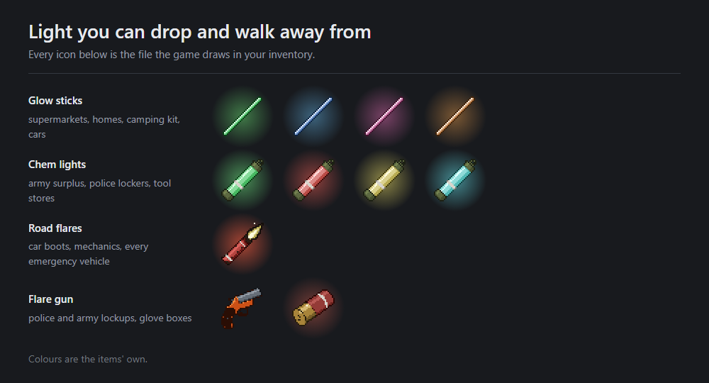

# Lugli - Emergency Lights

Glow sticks, chem lights, road flares and a flare gun for Project Zomboid **B42**.

Build 42 has none of them, and a matching hole underneath: a lit item on the ground emits no light
at all, which is why vanilla puts a lamp out *before* it lands. These do not go out. Crack one and
it burns wherever you leave it.



## Requires ZombieBuddy

**Not optional.** [ZombieBuddy](https://steamcommunity.com/sharedfiles/filedetails/?id=3619862853)
loads the small jar that reaches the native light call. Enable both; load order does not matter.

`mod.info` declares `require=ZombieBuddy`, so the launcher refuses to enable this without it.
ZombieBuddy itself never reads that line, but vanilla does, and an item mod that hands you glow
sticks which cannot glow is worse than one the launcher turned away. Every call into the jar is
still feature detected and `pcall`ed, so a broken install degrades instead of erroring and says so
on screen.

The jar ships **unsigned**. ZombieBuddy resolves an unlisted author's key by fetching their Steam
profile page on every launch, and any other answer fails closed with no approve button. Unsigned
takes the ordinary approve-once path instead. Key queued at
[ZombieBuddy PR #44](https://github.com/zed-0xff/ZombieBuddy/pull/44).

## The bridge

Lua's only way to place a light is `IsoCell.addLamppost`, which applies three Java-side limits
before the native call ever sees the request:

| | `addLamppost` | this mod |
|---|---|---|
| radius | clamped to 20 tiles | as asked |
| colour | doubled, then clamped | as asked |
| cost per light | marks the whole scene for a global relight | none |

It also resolves the held-item bone, so a carried light sits on the burning tip rather than at your
feet.

Both halves take a JVM system property, which belongs in the `vmArgs` list inside
`ProjectZomboid64.json`, **not** Steam launch options, which never reach the JVM. Steam replaces
that file on update.

| Switch | Effect |
|---|---|
| `-Dlugli.emergencylights.worldlight=off` | Light globals not registered |
| `-Dlugli.emergencylights.heldpoint=off` | Held-item bone globals not registered |

## What it adds

23 items across four families. Every colour ships sealed and lit, and each family has its own spent
item: a burnt road flare leaves a burnt road flare, not a glow stick.

| Family | Colours | Burn | Radius | Where it spawns |
|---|---|---|---|---|
| Glow stick | green, blue, pink, orange | 4 h | 5, one room | Supermarkets, houses, kids' rooms, camping crates; camper, adventurer and teenagers' vehicles |
| Chem light | green, red, yellow, cyan | 8 h | 10, a house or a street and both pavements | Army surplus, police lockers, tool stores; army, SWAT, police and ranger vehicles |
| Road flare | red | 30 min | 15, hard flickering light plus a sky wash | Car supply shelves, mechanics, every emergency vehicle; a small chance in any boot |
| Flare gun | with its own cartridge | 5 min | 40, overhead | Police and army lockups, camping crates; ranger, fire and survivalist glove boxes |

Radii are in tiles. **Vanilla caps a street lamp at 20**, which is the ceiling the bridge above
exists to get past: a road flare reaches three quarters of it from your hand and the flare gun goes
to twice it.

**Every duration is in-game time**, read off `getWorldAgeHours`, so all four scale with the day
length setting rather than the wall clock. Every figure in the table is the sandbox default, not a
limit.

## How they behave

- **Cracking is irreversible.** No off switch: a cracked stick is a chemical reaction and a lit
  flare is burning.
- **Dropped items keep burning.** Walk away, come back later, still lit.
- **Throwing uses the real animation and aiming**, and lands where you aimed. The engine's thrown
  object makes a noise identical to a ringing house alarm; these are silent by default.
- **The light dims as it burns down**, then goes out and leaves the spent item.
- **State survives everything.** A lit item is a swapped item plus an absolute timestamp, so it
  reads the same across saves, reloads, containers and multiplayer clients.

## Sandbox options

New Game screen, under `LugliEL`, saved in a preset like any vanilla setting.

| Group | Options |
|---|---|
| Burn time | `GlowStickHours` `ChemLightHours` `RoadFlareHours` |
| Light radius | `GlowStickRadius` `ChemLightRadius` `RoadFlareRadius` |
| Light look | `LightIntensity` `LightSaturation` `LightFlicker` `LightIncidence` |
| Throwing | `ThrowRangeMult` |
| Noise | `CrackNoise` `ThrowNoise` `FlareNoise` `FlareGunNoise` `AerialNoise` |
| Flare gun | `AerialShotRange` `AerialSeconds` `AerialLightRadius` `AerialRange` |
| Road flare | `FlareWash` `FlareFire` `CarriedFlareSound` |
| Map | `MapMarker` `MapRangeCircle` |
| Loot | `LootMultiplier` |
| Performance | `SweepRadius` `SweepSeconds` |
| Diagnostics | `DebugLog` `DebugRanges` |

`SweepRadius` and `SweepSeconds` bound the scan that finds lit items near the player. Lower them to
get the frame time back.

## Compatibility

- Singleplayer, multiplayer and dedicated servers. Items and timers are server side, light is drawn
  per client.
- Safe to add mid-save: items appear in containers the game has not generated yet, so buildings you
  have stripped stay stripped. Safe to remove.
- The *Explosives* mod also has a handheld road flare. Different module, so no conflict, but an
  honest overlap on one family.
- English and Brazilian Portuguese, both complete.

## Credits

**Flare gun model:**
["Low Poly Flare Gun"](https://sketchfab.com/3d-models/low-poly-flare-gun-ccf38c8f0cb74a8cbd237ab4a0ba1467)
by [Naudaff3D](https://sketchfab.com/Naudaff3D), licensed
[CC BY 4.0](http://creativecommons.org/licenses/by/4.0/), attribution required, commercial use
allowed. Converted to PZ's model format with a flat palette texture; geometry unmodified.

**Sound:** seven CC0 clips, no attribution required.

**Everything else** is original work under this mod's licence.

## Layout

```
art/           preview, icon, and the graphics this page uses
assets/media/  textures, models, sounds, shaders, item and sandbox scripts, translations
java/          the ZombieBuddy bridge, compiled into the shipped jar
lua/           client/, server/ and shared/
mod.info       the in-game manifest
workshop.txt   the Steam listing, BBCode
```

MIT. Part of [PZWorkspace](https://github.com/ViniciosLugli/PZWorkspace).
