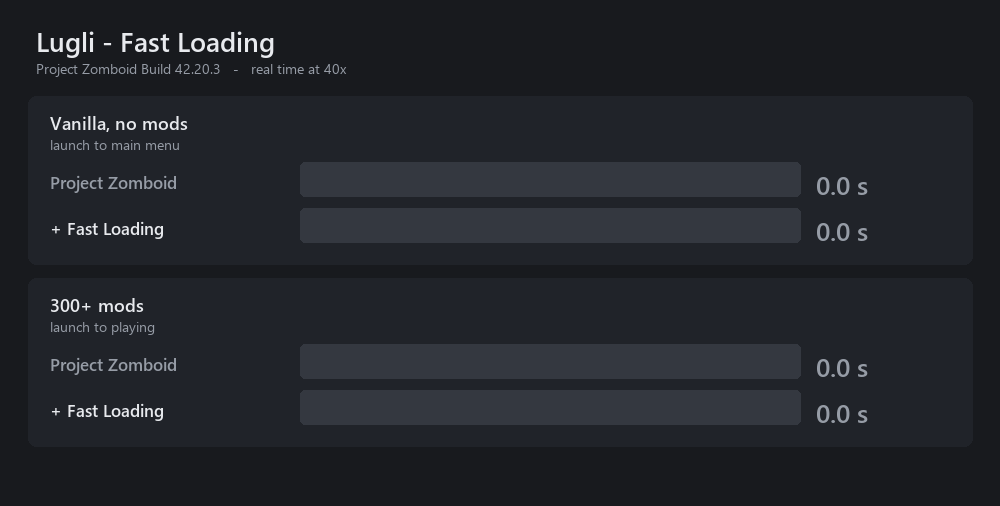

# Lugli - Fast Loading

Project Zomboid **B42** spends most of its loading time on work it does not need to do. This mod
finds that work in the engine and removes it. Nothing a player would notice is skipped: the item
database, the loot tables and the tilesets are fingerprinted on every build and must match an
unpatched run or the build fails.



| | without | with | delta |
|---|---|---|---|
| Vanilla, launch to main menu | 20.3 s | 12.8 s | **-37 %** |
| 300+ mods, launch to playing | 129.2 s | 77.9 s | **-40 %** |

Build 42.20.3, same machine, same save, 5 s wait at the menu, 12 launches with the arms
interleaved and every run verified against its own log. Bands 128.3-130.2 → 76.9-78.0 and
19.9-26.1 → 12.5-13.0.

[Steam Workshop](https://steamcommunity.com/sharedfiles/filedetails/?id=3787104045) ·
requires [ZombieBuddy](https://steamcommunity.com/sharedfiles/filedetails/?id=3619862853) for the
engine patches; without it only the two Lua loot fixes run and the mod says so on the main menu.

## Where loading time actually goes

The measured model, exact to 0.01 s on both arms:

```
total = front_gap + asset_drain + gaps        asset_drain = loader_work + asset_barrier
```

The loader phases — loot merge, animal definitions, zones, tile definitions — run *underneath*
the asset pipeline, and the barrier at the end is only the residual wait. So for most of this
project's life **loader-side work was worth nothing**: the ~10 s distribution merge, the largest
single row in any phase dump, cost zero wall clock because textures were still decoding beneath
it. Everything that mattered was asset work — 18,795 tasks at ~2.4 ms each.

Measured both ways: with the mod off, `0.85 + 74.19 + 3.62 = 78.67 s`; with it on,
`5.95 + 44.57 + 4.15 = 54.67 s`. Both match the engine's own `game loading took` exactly.

### The largest single cost was a throttle, and it was this mod's own

Every image task waits in `TextureIDAssetManager.waitFileTask` until live direct-buffer bytes fall
under a budget. Vanilla hardcodes 50 MB; this mod had already raised it to `heap/8` capped at
1 GB. One world load still spent **433.7 seconds of asset-worker time asleep in that gate** —
blocked on 21 % of calls, roughly half of all worker time across boot plus load.

That one number explained every symptom that had resisted three rounds of investigation: workers
sitting at 15-25 % of a core, total CPU at 276 % of a possible 1200 %, throughput pinned near
250 tasks/s no matter what else changed, and — the clue that should have given it away — raising
the in-flight cap from 16 to 48 making worker CPU *fall*, because a deeper queue means more live
decoded buffers and therefore more crossings of the same gate.

| budget | world load | launch to playing |
|---|---|---|
| 768 MB (old default) | 54.7 s | 88.1 s |
| 1024 MB | 50.0 s | 83.6 s |
| **2048 MB** | **39.7 s** | **73.3 s** |
| 4096 MB | 40.0 s | 73.7 s |

4096 buys nothing over 2048, so peak live direct-buffer usage on a 300+ mod list is about 2 GB
and a budget above that never binds. The rule is now `heap/2` capped at 2 GB, so it scales with
the machine rather than being tuned to one.

Verified not to regress: vanilla boot is 12.48-12.54 s at the new default against 12.49-12.56 s
at the old, interleaved — the gate barely fires without a mod list. Error-texture substitutions
are 1 in both arms over ~1.2 M texture binds on a real save (pre-existing, not introduced).

### What that exposed

Removing a blocker moves the wait rather than deleting it. With the budget raised, the asset
barrier collapsed from 18.6 s to 3.6 s and `loadAnimalDefinitions` — which waits on animation
meshes — grew from 4.1 s to 9.5 s. The bottleneck is now the loader phases, not the asset
pipeline, which inverts what is worth building next.

## What the mod changes

| | instead of |
|---|---|
| Intro logos skipped | Playing them after loading has already finished |
| Mod folder walk on 8 threads, override order unchanged | One folder at a time, 678 trees deep |
| Lua scan resolves a path once per folder | Once per file |
| Tile geometry parsed on a worker thread | On the thread you are waiting for |
| Script tokenizer stops re-copying the file per item | 428 ms of pure copying, down to 76 ms |
| Depth-map tilesets decoded in parallel | All of them behind one global lock |
| Compiled model shaders cached | Recompiled through the render thread every load |
| Vehicle textures decoded during menu time | While you are waiting to spawn |
| Buffer budget from your heap, pool from your core count | A hardcoded 50 MB and 4 threads |
| Loot table parsed once, after every mod has added to it | Once per mod that asks, about 9 times |
| SWMG Gunworks loot insert indexed | 78.3 s down to 8.1 s, if you run that mod |

Where engine code is replaced, the replacement is run against the original and switches itself
off on any disagreement, reporting it on the main menu.

## Java signing and ZombieBuddy

**The released jar is currently unsigned, deliberately.** ZombieBuddy resolves a signer's public
key from its bundled `authors.json` first and, for an author not on that list, falls back to
fetching the author's Steam profile page and scraping the key out of it — *on every launch, for
every user*. Any answer other than the page (rate limit, outage, VPN, blocked connection) throws,
and the approval dialog then refuses the mod outright with **no approve button**:
`Cannot trust author: signature is invalid.`

With no `.zbs` sidecar, `ZBSVerifier.check` takes a different branch entirely —
`allowUnsignedMods` defaults to **true** — and the user gets an ordinary one-time approval prompt
they can accept. Until the ZombieBuddy author adds this key to the shared list, unsigned is
strictly better for players than a signature that only verifies when Steam cooperates.

If a user still cannot enable it, `-agentlib:zbNative=policy=allow-all` in the `vmArgs` list of
`ProjectZomboid64.json` skips the check — for every Java mod, not just this one.

## Switches

All 23 parts can be turned off individually. These are **JVM system properties**, so they belong
in the `vmArgs` list inside `ProjectZomboid64.json` in the game folder — *not* Steam launch
options, which never reach the JVM. Steam replaces that file when it updates the game.

| switch | default | effect when set |
|---|---|---|
| `-Dfastloading.logo=keep` | on | play the intro logos |
| `-Dfastloading.watchergate=off` | on | keep the media hot-reload watcher registered |
| `-Dfastloading.parse=off` | on | use the engine's script tokenizer |
| `-Dfastloading.tilegeom=off` | on | parse tile geometry on the main thread |
| `-Dfastloading.luascan=off` | on | use the engine's Lua directory scan |
| `-Dfastloading.modwalk=off` | on | use the engine's serial mod folder walk |
| `-Dfastloading.assets=off` | on | use the engine's 50 MB buffer cap and 4 asset threads |
| `-Dfastloading.assetbudget=N` | auto (`heap/2`, max 2048) | live direct-buffer megabytes tolerated before a worker sleeps |
| `-Dfastloading.assetpoll=N` | 20 | milliseconds between budget re-checks |
| `-Dfastloading.assetstats=on` | off | log the gate counters while they move (diagnostic) |
| `-Dfastloading.assetstatsms=N` | 5000 | milliseconds between those lines |
| `-Dfastloading.shadercache=off` | on | recompile model shaders every load |
| `-Dfastloading.tiledepth=off` | on | decode depth tilesets inside the engine's global lock |
| `-Dfastloading.vehtex=off` | on | load vehicle textures during world load, as the game does |
| `-Dfastloading.progress=off` | on | no loading progress bar |
| `-Dfastloading.logstat=off` | on | check the log file size on every written line |
| `-Dfastloading.luaindex=off` | on | use the engine's linear scan of loaded Lua files |
| `-Dfastloading.gunidx=off` | on | search the Gunworks loot tables per insert instead of indexing |
| `-Dfastloading.lootinit=off` | on | let every mod re-run the loot table parse from its own handler |
| `-Dfastloading.meshprio=on` | off | meshes ahead of textures: ~12 s off boot, ~22 s onto world load (measured 10.6 s worse end to end) |
| `-Dfastloading.uiprio=on` | off | queue the menu's own UI textures first |
| `-Dfastloading.clothprio=on` | off | queue clothing XML ahead of textures (measured no gain) |
| `-Dfastloading.packwarm=on` | off | decode tile-pack pages at the menu (17 s slower unless you idle a minute) |
| `-Dfastloading.bufalloc=on` | off | allocate texture buffers outside the global lock (measured no change) |
| `-Dfastloading.census=on` | off | log a count of every asset task queued (diagnostic) |
| `-Dfastloading.logowait=N` | 0 | hold the logos until the menu textures are ready, up to N ms |

On a **dedicated server** none of these apply — the jar does not load there at all, so the boot
and texture work is client-side. The two Lua parts are switched from Lua instead:
`FastLoadingDisableGunIndex = true` or `FastLoadingDisableLootInit = true` from any server Lua
file.

## Layout

```
mod.info                  the descriptor as shipped
workshop.txt              the Steam listing, tracked as source
lua/client, lua/shared    map to media/lua/... in the built mod
java/                     ZombieBuddy patch sources, compiled into the shipped jar
art/                      preview, icon, and the measurement graphic above
```
