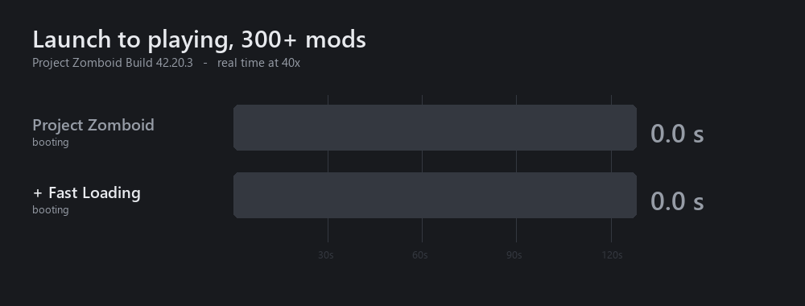

# Lugli - Fast Loading

Project Zomboid B42 does a lot of loading work it does not need to do. This mod finds that work
in the engine and removes it. The item database, the loot tables and the tilesets are fingerprinted
on every build and must match an unpatched run, or the build fails.



*Real time at 40x, boot and world load shown separately. Vanilla is in the table below.*

| | without | with | delta |
|---|---|---|---|
| Vanilla, launch to main menu | 20.3 s | 12.8 s | **-37 %** |
| 300+ mods, launch to main menu | 46.8 s | 35.1 s | **-25 %** |
| 300+ mods, launch to playing | 127.8 s | 85.5 s | **-33 %** |

Build 42.20.3, same machine, same save, 5 s wait at the menu, arms interleaved, every run checked
against its own log, and a stock engine with no local-only patches. Bands: 19.9-26.1 to 12.5-13.0,
46.8-46.9 to 33.6-36.0, and 127.8-127.9 to 83.6-86.8.

[Steam Workshop](https://steamcommunity.com/sharedfiles/filedetails/?id=3787104045).
Needs [ZombieBuddy](https://steamcommunity.com/sharedfiles/filedetails/?id=3619862853) for the
engine patches. Without it only the two Lua loot fixes run, and the mod says so on the main menu.

## Where the time goes

```
total = front_gap + asset_drain + gaps        asset_drain = loader_work + asset_barrier
```

The loader phases (loot merge, animals, zones, tile definitions) run underneath the asset
pipeline. The barrier at the end is only the leftover wait. So loader work was free: the 10 s
distribution merge, the biggest row in any phase dump, cost no wall clock at all because textures
were still decoding beneath it. All of the cost was asset work, 18,795 tasks at ~2.4 ms each.

The model is exact on both arms. Mod off: `0.85 + 74.19 + 3.62 = 78.67 s`. Mod on:
`5.95 + 44.57 + 4.15 = 54.67 s`. Both match the engine's own `game loading took`.

## The biggest single cost was this mod's own throttle

Every image task waits in `TextureIDAssetManager.waitFileTask` until live direct-buffer bytes drop
below a budget. Vanilla hardcodes 50 MB. This mod had raised it to `heap/8` capped at 1 GB, and one
world load still spent **433.7 seconds of asset-worker time asleep in that gate**, blocked on 21 %
of calls.

That accounts for the symptoms: workers at 15-25 % of a core, total CPU at 276 % of a possible
1200 %, throughput stuck near 250 tasks/s, and raising the in-flight cap from 16 to 48 making
worker CPU *fall*, since a deeper queue means more live buffers and more trips through the gate.

| budget | world load | launch to playing |
|---|---|---|
| 768 MB (old default) | 54.7 s | 88.1 s |
| 1024 MB | 50.0 s | 83.6 s |
| **2048 MB** | **39.7 s** | **73.3 s** |
| 4096 MB | 40.0 s | 73.7 s |

4096 buys nothing over 2048, so peak usage on a 300+ mod list is about 2 GB and anything above
that never binds. The rule is now `heap/2` capped at 2 GB, so it scales with the machine.

Vanilla is unaffected: 12.48-12.54 s at the new default against 12.49-12.56 s at the old,
interleaved. The gate barely fires without a mod list. Error-texture substitutions are 1 in both
arms over ~1.2 M texture binds on a real save, so pre-existing.

Removing that block moved the wait rather than deleting it. The asset barrier fell from 18.6 s to
3.6 s while `loadAnimalDefinitions`, which waits on animation meshes, grew from 4.1 s to 9.5 s.
The loader phases are the bottleneck now, not the asset pipeline.

## What it changes

| | instead of |
|---|---|
| Intro logos skipped | Playing them after loading has finished |
| Mod folder walk on 8 threads, override order unchanged | One folder at a time, 678 trees deep |
| Lua scan resolves a path once per folder | Once per file |
| Tile geometry parsed on a worker thread | On the thread you are waiting for |
| Tokenizer stops re-copying the file per item | 428 ms of copying, down to 76 ms |
| Depth tilesets decoded in parallel | All of them behind one global lock |
| Compiled model shaders cached | Recompiled through the render thread every load |
| Vehicle textures decoded at the menu | While you wait to spawn |
| Buffer budget from your heap, pool from your cores | A hardcoded 50 MB and 4 threads |
| Loot table parsed once, after every mod has added | Once per mod that asks, about 9 times |
| SWMG Gunworks loot insert indexed | 78.3 s down to 8.1 s, if you run that mod |
| A real loading screen: bar, phase, elapsed, walking figure | A blank window the OS can mark unresponsive |
| Options screen opens without waiting on the render thread | Blocking round-trips behind every queued texture upload |

Where engine code is replaced, the replacement runs against the original and disables itself on
any disagreement, reporting it on the main menu.

## Signing

The jar is signed. ZombieBuddy verifies it by looking the signer's key up in its bundled
`authors.json` and, for an author who is not listed, falling back to fetching that author's Steam
profile page and reading the key published there. That happens on every launch, for every user.

That fallback is the one weak point. Any answer other than the page (rate limit, outage, VPN,
blocked connection) throws, and the dialog then refuses the mod with no approve button:
`Cannot trust author: signature is invalid.` It is a failed web request, not a bad file.
`tools/sign-jars.sh` verifies every signature it produces, and the published jar verifies
against the key on the profile.

Users hitting it can restart a few minutes later, or set
`-agentlib:zbNative=policy=allow-all` in the `vmArgs` list of `ProjectZomboid64.json` to skip the
check for every Java mod. The permanent fix is being added to ZombieBuddy's bundled author list,
which removes the network from the path entirely.

`tools/sign-jars.sh` signs and verifies; `--unsigned` ships without a sidecar instead, which
takes ZombieBuddy's `allowUnsignedMods` branch and always yields an approvable prompt.

## The loading screen

Vanilla writes its loading phases to the log and leaves the window blank, so a long boot looks
frozen and the OS can mark the game unresponsive. This mod draws a real one instead: a progress
bar, the phase name, elapsed time, and the same walking figure the world-loading screen uses.

The bar is **learned, not counted**. The engine's phases are wildly uneven, so "step 3 of 7"
would sit still for twenty seconds and then jump. Each phase's duration is written to
`Zomboid/fastloading-boot.txt` and reused next launch, so the second boot onwards moves at a rate
that matches your machine. It is also monotonic by construction, because texture packs are
announced throughout boot and a bar that can retreat is worse than none.

Two things worth knowing before you install:

- The figure is fetched with the same call the world-loading screen uses, so a mod that replaces
  that art is picked up here too. Set `-Dfastloading.walktexture=PATH` to point it elsewhere.
- The engine's photosensitivity notice is **not shown by default**. It normally occupies the
  screen for the whole Lua phase, which conflicts with a live loading screen. Set
  `-Dfastloading.warningms=5000` to show it on the loading screen for five seconds, or
  `-Dfastloading.warningms=-1` to leave the engine's own frame exactly as it is.

Turn the whole thing off with `-Dfastloading.progress=off` and boot looks like vanilla.

## Switches

JVM system properties, so they go in the `vmArgs` list inside `ProjectZomboid64.json` in the game
folder, not Steam launch options, which never reach the JVM. Steam replaces that file on update.

| switch | default | effect when set |
|---|---|---|
| `-Dfastloading.logo=keep` | on | play the intro logos |
| `-Dfastloading.watchergate=off` | on | keep the media hot-reload watcher registered |
| `-Dfastloading.parse=off` | on | use the engine's script tokenizer |
| `-Dfastloading.tilegeom=off` | on | parse tile geometry on the main thread |
| `-Dfastloading.luascan=off` | on | use the engine's Lua directory scan |
| `-Dfastloading.modwalk=off` | on | use the engine's serial mod folder walk |
| `-Dfastloading.assets=off` | on | use the engine's 50 MB cap and 4 asset threads |
| `-Dfastloading.assetbudget=N` | auto (`heap/2`, max 2048) | direct-buffer megabytes before a worker sleeps |
| `-Dfastloading.assetpoll=N` | 20 | milliseconds between budget re-checks |
| `-Dfastloading.assetcache=N` | 20 | milliseconds a live-buffer reading stays reusable |
| `-Dfastloading.assetprio=N` | 0 | asset worker thread priority, 1-10; 0 leaves the JVM default |
| `-Dfastloading.uploadcap=N` | 0 | how far the render thread may fall behind on uploads while the menu is up; 0 = no limit |
| `-Dfastloading.assetstats=on` | off | log the gate counters while they move |
| `-Dfastloading.assetstatsms=N` | 5000 | milliseconds between those lines |
| `-Dfastloading.demandprio=off` | on | queue textures the player just asked for behind background ones |
| `-Dfastloading.demandband=N` | 9 | priority for a texture requested while the menu is up |
| `-Dfastloading.bulkband=N` | 3 | priority for the vehicle warm's textures |
| `-Dfastloading.demandwindow=N` | 2000 | milliseconds background asset work stands down after a demand request |
| `-Dfastloading.querycache=off` | on | ask the render thread again for a capability answer that cannot change |
| `-Dfastloading.shadercache=off` | on | recompile model shaders every load |
| `-Dfastloading.tiledepth=off` | on | decode depth tilesets inside the global lock |
| `-Dfastloading.vehtex=off` | on | load vehicle textures during world load |
| `-Dfastloading.vehtexslice=N` | 8 | vehicle scripts warmed per slice |
| `-Dfastloading.vehtexinterval=N` | 100 | milliseconds between warm slices |
| `-Dfastloading.vehtexquiet=N` | 96 | pending asset tasks below which the warm may run |
| `-Dfastloading.progress=off` | on | no loading screen |
| `-Dfastloading.progressms=N` | 80 | milliseconds between loading-screen frames |
| `-Dfastloading.progressidle=N` | 120000 | safety cap: stop drawing this long after the last phase |
| `-Dfastloading.warningms=N` | 0 | photosensitivity notice: 0 hides it, >0 shows it for N ms, -1 lets the engine draw its own |
| `-Dfastloading.walktexture=PATH` | media/ui/Progress/MaleWalk2.png | the animation on the loading screen |
| `-Dfastloading.artpumpms=N` | 300 | milliseconds between the bounded pumps that fetch the loading art |
| `-Dfastloading.artpumpwindow=N` | 8000 | milliseconds into boot after which those pumps stop |
| `-Dfastloading.logstat=off` | on | check the log file size on every written line |
| `-Dfastloading.luaindex=off` | on | use the engine's linear scan of loaded Lua files |
| `-Dfastloading.gunidx=off` | on | search the Gunworks tables per insert instead of indexing |
| `-Dfastloading.lootinit=off` | on | let every mod re-run the loot parse from its own handler |

None of these apply on a dedicated server, where the jar does not load at all. The two Lua parts
are switched from Lua instead: set `FastLoadingDisableGunIndex = true` or
`FastLoadingDisableLootInit = true` in any server Lua file.

## Layout

```
mod.info                  the descriptor as shipped
workshop.txt              the Steam listing, tracked as source
lua/client, lua/shared    map to media/lua/... in the built mod
java/                     ZombieBuddy patch sources, compiled into the shipped jar
art/                      preview, icon, and the graphic above
```
