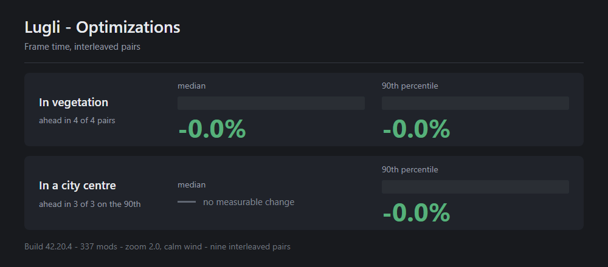
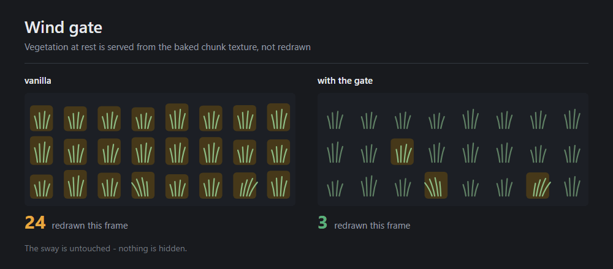
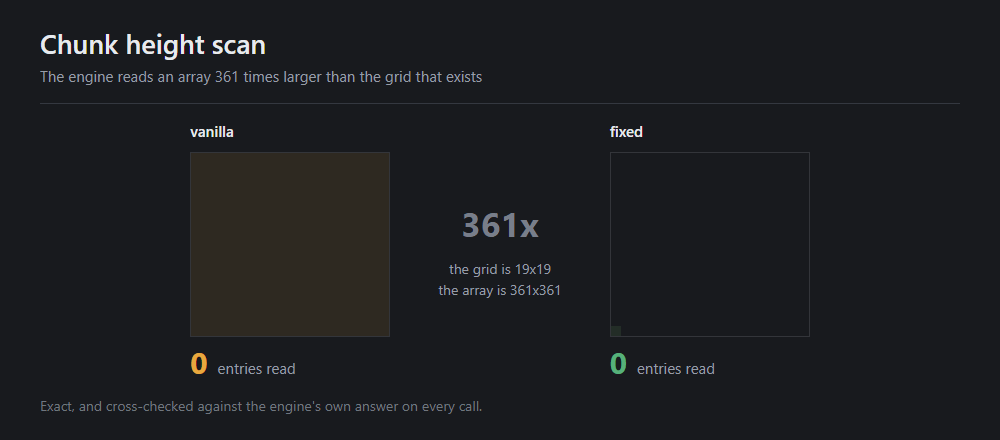
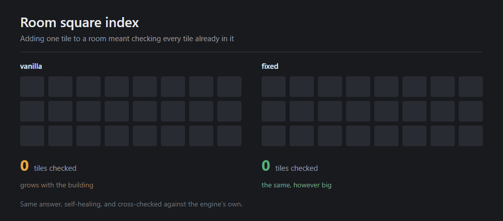

# Lugli - Optimizations

Project Zomboid **B42** repeats work every frame that did not need doing at all. This finds it and
stops it, and because the work is per-frame the saving comes back with every frame you draw, not
once when you load. Nothing about what you see or how the game plays changes: every part recomputes
the engine's own answer and disables itself if the two ever differ.

Frame time, not loading. It is the companion to
[Fast Loading](https://github.com/ViniciosLugli/PZWorkspace/tree/main/Lugli_FastLoading): that one
gets you into the world, this one is about the milliseconds after.

Needs [ZombieBuddy](https://steamcommunity.com/sharedfiles/filedetails/?id=3619862853) for the
engine patches. Without it the mod does nothing, and says so on the main menu rather than
pretending to work.

**In active development and maintained.** Parts are added as they pass the gate described below,
so the figures here are a snapshot rather than a ceiling, and I keep this current as Build 42
moves.



## Measured

Build 42.20.4, 337 mods, `s1b` traversal, zoom 2.0, declared wind 0.15. Arms interleaved A,B,A,B,
every run checked against its own log, the first pair of each campaign discarded as cold. Nine
interleaved pairs across the two scenes, all 18 runs valid, `windgate=fast|off` the only variable.

| scene | p50 | p90 | p99 |
|---|---|---|---|
| **Vegetation** (Muldraugh) | **-16.3 %** | **-18.4 %** | -15.8 % |
| pairs won by the mod | 4 / 4 | 4 / 4 | 4 / 4 |
| **City centre** (Louisville) | *null* | **-8.7 %** | -9.8 % |
| pairs won by the mod | 2 / 3 | 3 / 3 | 2 / 3 |

p50 is the typical frame; **p90 is the roughest frame in ten, which is where stuttering shows**.
In vegetation both improve, so it is faster and smoother. In a city only the rough frames improve,
which is a smoothness result rather than a throughput one.

**The city p50 is a null and is published as one.** Two of three pairs win it by a couple of
percent and one is flat: noise, not an effect. p90 is consistent at 3/3 and is the honest city
claim.

**Percentages only.** Both arms carry the benchmark harness itself and another mod's loose engine
classes, so the deltas are sound but the absolute millisecond figures are not what your machine
would show. This is not a gap a later campaign closes: the harness is the instrument, so removing
it removes the measurement. No fps figure is published, in any form.

The exact figures behind the percentages are counts rather than times, and a harness present in
both arms does not change how often the engine acts: the gate returns **1,112,057 -> 7,145** draws
across the wind seam, `zextents` reads **130,321 -> 361** array entries, and `roomindex` replaces
a linear scan with one lookup.

**Attach the conditions:** *calm or light wind, zoomed out, in vegetation.* At wind >= 0.45 the
gate never engages at all, and in a city centre the median effect is a null.

## Where the time goes

Vegetation that sways is drawn separately from the world every frame, on the thread that sets your
framerate. The engine's own probe for that work, `translucentNonFloor`, is about **20 % of the
frame in vegetation** and about **2.7 % in a city centre** - which is exactly why the win is
scene-dependent, and why the city numbers are smaller rather than being averaged into one
flattering figure.

The gate's operating range is the engine's own calm band. `ClimateManager` generates wind as
`Rand.Next(calm ? 0.0 : 0.3, calm ? 0.3 : 1.0)`, and the gate is fully effective to wind **0.30**
and inert from **0.45** - across that seam the number of gated draws falls **1,112,057 -> 7,145**.
So it covers the whole calm band and none of the storm band, by construction.

## What it changes

**Wind gate** - the part with a measurable frame-time win.



While a plant is not actually moving it does not need to be redrawn every frame. This returns it
to the cached chunk texture until it moves again. The sway is fully preserved: nothing is disabled
and nothing looks different.

**Chunk height scan** - the engine reads 130,321 array entries where 361 hold the answer.



**Room square index** - before adding a tile to a room the game checked every tile already in it,
one at a time. Now it goes straight there.



Both of the last two are real optimisations - the same answer for far less work, every call
cross-checked against the engine's own. Neither is large enough to feel on its own; they ship
because they are exact and self-checking.

Two further parts ship **off**, and say why:

- **`uistagger`** phases the 10 Hz UI Lua tick across frames instead of one burst. It cuts late
  flushes from 18-24 % of windows to 2.8-4.0 %, but an isolated A/B put all three frame-time bands
  in overlap - twice, in two different scenes. It ships off rather than claim a default it did not
  earn.
- **`chunklua`** defers the per-square `LoadGridsquare` Lua burst off chunk-arrival frames. See
  below.

## Why the list is short

Every change had to survive the same gate before a line of it was written:

**Nanoseconds saved per operation, measured -- times operations per frame, counted in the running
game -- against the noise floor.** Below the floor, the arithmetic is the finding and nothing gets
built. Each candidate is measured on its own, in more than one scene, because a win in vegetation
and a null in a city centre are the same part.

Two conditions, not one. It has to be **safe**: identical results, nothing assumed about the engine
or the game that they do not already guarantee, and no behaviour traded for frames. Dropped work,
deferred handlers and reduced simulation are gameplay changes; they ship behind a declared switch,
off by default, or not at all. And the gain has to be **real** at the scale the game runs at.

That gate has rejected far more than it passed, including ideas that looked excellent in isolation:
a 361x algorithmic win the JIT had already erased, a cache slower than the walk it replaced, a
94.5 % cut of a tax worth 0.34 % of the real cost, 16x fewer GL calls on a thread that was already
idle, and a 43 % faster table probe the game does not perform often enough to matter. Each was
measured, rejected and deleted rather than shipped as a plausible-sounding bullet point.

## Safety

Every part recomputes the engine's own answer for its first calls and compares. On any
disagreement it **permanently disables itself** and logs the values that caused it, rather than
risk something looking wrong. `windgate` additionally flips to the always-correct per-frame path if
it ever finds a gated effect displaced.

Each part also reports on the main menu whether it actually installed, because a patch that
silently stopped existing looks exactly like one that never mattered.

No dependencies beyond ZombieBuddy, no mod-specific patches, no game settings changed, nothing
written to your save. The jar never loads on a dedicated server.

**Expect conflicts with other optimisation mods.** Anything patching the same engine methods
collides with this, and whichever loads last wins silently: behaviour gets unpredictable, the
self-checks compare against an answer that is no longer the engine's, and none of the measurements
above survive. That combination is not supported, because there is no way to attribute a fault to
one mod or the other. Turn one off before reporting a problem.

## Signing

The jar ships **unsigned**, deliberately.

ZombieBuddy verifies an unlisted author's key by fetching that author's Steam profile page on every
launch, for every user. Any answer other than the page -- rate limit, outage, blocked connection --
fails closed, and the approval dialog then refuses the mod with no approve button. With no
signature at all, `ZBSVerifier.check` takes a different branch: `allowUnsignedMods` defaults to
**true** and the user gets an ordinary one-time approval prompt. The cost is preload, which
requires a valid signature.

This key is queued at [ZombieBuddy PR #44](https://github.com/zed-0xff/ZombieBuddy/pull/44). When
it merges, signing and preload both come back.

Fast Loading ships the same way for the same reason.

## `chunklua`, and why it is off

It was long believed that deferring a square's `LoadGridsquare` event past its chunk unloading lost
that event. **That was wrong.** `IsoChunk.doLoadGridsquare` fires for every non-empty square on
*every* entry of a chunk into the world - 49,330 of 60,000 tracked coordinates fired more than once
in a single city run - and the drain re-resolves by coordinate rather than holding a pooled square,
so the deferral is lossless by construction and reports zero lost events.

It stays off on frame time alone. Five interleaved pairs in a city centre:

| | p50 | p90 | p99 |
|---|---|---|---|
| delta | +2.1 % | +2.4 % | **-13.2 %** |
| pairs won by `spread` | 1 / 5 | 2 / 5 | 4 / 5 |

The tail improves, but the typical frame drifts slightly the wrong way and the p99 bands overlap;
one pair went **+14.9 %**. A default has to be better than that. `-Dlugli.opt.chunklua=spread`
takes the trade if you want it.

It also carried a governor that tightened the drain window on stale entries, because stale used to
mean lost. It no longer does, so the governor was buying nothing and it was not free: with it
active the mod cost **p50 +5.7 % and p90 +7.4 %**, both bands separated the wrong way.
`-Dlugli.opt.chunklua.dropppt` now defaults to `1000`, which never tightens.

## Switches

Every part takes `off`, an observe-style middle mode, and a fast mode. The middle mode is what
makes an honest A/B possible: it counts exactly what the fast path *would* have done and changes
nothing, so both arms keep the mod installed and differ only by this property.

| switch | default | effect |
|---|---|---|
| `-Dlugli.opt.windgate=off\|observe\|fast` | `fast` | return at-rest wind vegetation to the baked chunk texture; `observe` counts what would be gated |
| `-Dlugli.opt.zextents=off\|verify\|fast` | `fast` | skip the 361x over-scan in `calculateZExtentsForChunkMap`; `verify` cross-checks every call against the engine's full scan |
| `-Dlugli.opt.roomindex=off\|verify\|fast` | `fast` | replace `IsoRoom.addSquare`'s linear `contains` scan with a hash lookup; `verify` cross-checks every call |
| `-Dlugli.opt.uistagger=on` | `off` | phase the 10 Hz UI Lua tick across frames instead of one burst |
| `-Dlugli.opt.uistagger.slices=N` | `4` | how many frames one UI tick window is spread over |
| `-Dlugli.opt.chunklua=off\|observe\|spread` | `observe` | defer the per-square `LoadGridsquare` Lua burst off chunk-arrival frames |
| `-Dlugli.opt.chunklua.budget=N` | `4000` | microseconds per frame the deferred drain may spend, at rest |
| `-Dlugli.opt.chunklua.lag=N` | `12` | frames the drain aims to clear the current backlog within |
| `-Dlugli.opt.chunklua.ceil=N` | `4` | hard multiple of the resting budget one frame may ever take |
| `-Dlugli.opt.chunklua.dropppt=N` | `1000` | stale-entry rate, per thousand, above which the drain tightens its lag window; `1000` never tightens |
| `-Dlugli.opt.chunklua.maxqueue=N` | `60000` | deferred squares held before overflow falls back to the engine's inline path |
| `-Dlugli.opt.patchaudit.controls=false` | `true` | drop the diagnostic counter on `IsoRoom.getBuilding`; the audit then reports UNKNOWN instead of proving install state |

## Layout

```
art/                        the published explainer images
java/lugli/optimizations/   the mod source, one file per part
mod.info                    the in-game manifest
workshop.txt                the Steam listing, BBCode
```

MIT. Part of [PZWorkspace](https://github.com/ViniciosLugli/PZWorkspace).
